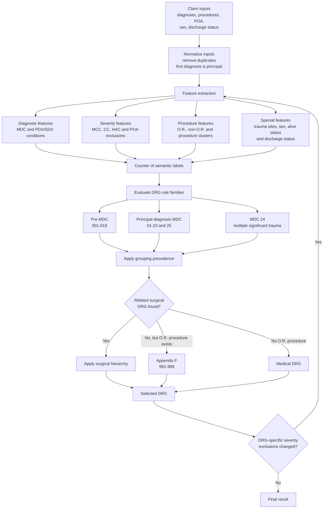
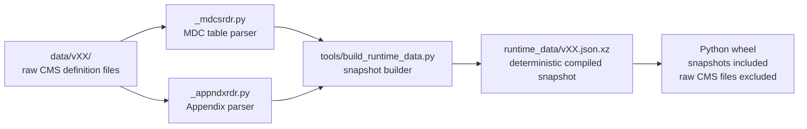
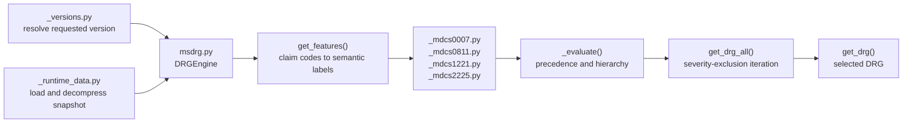
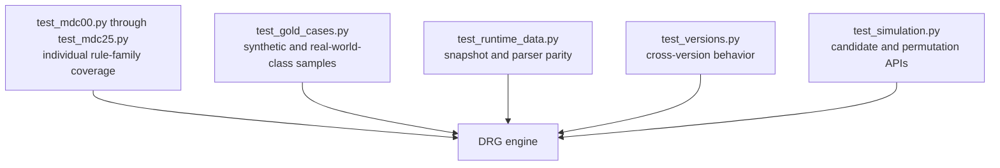

# Architecture

`drgpy` is best understood as two connected systems:

1. A build-time compiler that converts CMS definition files into compact,
   deterministic runtime data.
2. A runtime rules engine that converts claim inputs into semantic features,
   evaluates the MDC decision tables, and applies CMS grouping precedence.

The implementation is an open reconstruction of the bundled CMS decision
tables. It does not replace validation with the official CMS grouper, and it
cannot reproduce rules requiring unsupported inputs such as age or birth
weight.

## Conceptual Grouping Flow



## Semantic Feature Model

The runtime engine does not repeatedly interpret the raw CMS manuals. During
snapshot generation, diagnosis and procedure codes are mapped to semantic
labels. At runtime, `DRGEngine.get_features()` converts the claim into a
`Counter` containing those labels.

Representative labels include:

```text
_MDC08
_MCC
_ORPCS_EXTENSIVE
957&958&959|ORPCS
768|WITH ANY ORPCS EXCEPT
_TRAUMA24_SITE_HEAD
```

The MDC functions inspect combinations of these labels instead of raw ICD-10
codes. For example, the multiple-significant-trauma family is expressed as:

```python
if x["957&958&959|ORPCS"] > 0:
    if x["_MCC"] > 0:
        y.append("957")
    elif x["_CC"] > 0:
        y.append("958")
    else:
        y.append("959")
```

This creates a deliberate separation of responsibilities:

- CMS data files and parsers determine which codes produce which labels.
- MDC Python functions determine how combinations of labels produce DRGs.
- `DRGEngine._evaluate()` determines which candidate has precedence.

## Build-Time Data Flow



The compiled snapshot contains:

- Diagnosis-to-rule-label mappings.
- Procedure-to-rule-label mappings.
- DRG descriptions and medical/surgical classification.
- MCC and CC metadata and exclusions.
- DRG-specific severity exclusions.
- O.R. procedure mappings.
- Surgical hierarchy rankings.
- Appendix F non-extensive O.R. procedure mappings.

Run the following command after changing raw CMS files or parser behavior:

```bash
python -m tools.build_runtime_data
```

Generated snapshots must be committed with the source-data or parser change
that produced them. Snapshot tests ensure the compressed data is deterministic
and represents the checked-in CMS files.

## Runtime Module Flow



### Input Normalization

`get_features()` performs the following work:

1. Removes duplicate diagnosis and procedure codes while preserving order.
2. Treats the first diagnosis as principal and all others as secondary.
3. Adds diagnosis and procedure labels from the runtime maps.
4. Applies principal-diagnosis, alive-at-discharge, POA/HAC, and DRG-specific
   severity exclusions before adding MCC or CC features.
5. Recognizes multi-procedure definitions and special rule families.
6. Adds O.R. classification, sex, alive status, diagnosis-count, and discharge
   status features.

### Candidate Evaluation and Precedence

The effective selection order is:

```text
Pre-MDC
  -> otherwise MDC 24 when its entrance criteria are satisfied
  -> otherwise the principal-diagnosis MDC
  -> related surgical category and surgical hierarchy
  -> otherwise Appendix F when an unrelated O.R. procedure exists
  -> otherwise the medical DRG
  -> MCC / CC / without CC or MCC partition
  -> DRG-specific severity exclusions and reevaluation
```

MDC 24 requires an eligible principal trauma diagnosis and qualifying trauma
diagnoses from at least two distinct body sites. Once its entrance criteria are
met, it takes precedence over the principal diagnosis's ordinary MDC.

Appendix F DRGs 981-989 apply when the claim contains an O.R. procedure but the
active grouping branch has no related surgical result. Special exclusions, such
as excluded delivery procedures in MDC 14, are handled before Appendix F is
applied.

### Candidate Results Versus Selected Result

`get_drg()` returns the selected DRG. `get_drg_all()` keeps lower-priority
candidates for debugging and simulation.

For example:

```python
engine.get_drg_all(diagnoses, procedures)
# ["982", "445"]
```

Here, `982` is selected because the O.R. procedure is unrelated to the
principal diagnosis. `445` is retained as the medical candidate that would have
applied without Appendix F precedence.

## Simulation APIs

The simulation methods reuse the same grouping engine:

- `get_code_drg_candidates()` returns broad DRG references associated with one
  diagnosis or procedure code. It does not perform complete grouping.
- `simulate_drg_permutations()` groups the code set once for each diagnosis
  selected as principal. Secondary-diagnosis and procedure order are not
  permuted because those orders do not change grouping semantics.
- `get_possible_drgs()` returns the distinct selected outcomes from those
  principal-diagnosis simulations.
- `DRGEngineAllVers` selects the effective engine from a discharge date and
  delegates to the same APIs.

These functions simulate mechanical grouping outcomes. They do not determine
whether documentation, sequencing, or billing is clinically or legally
appropriate.

## Module Map

| Module | Responsibility |
| --- | --- |
| `drgpy/msdrg.py` | Main engine, feature extraction, precedence, hierarchy, and simulation APIs. |
| `drgpy/msdrg_allvers.py` | Date-based version selection and delegation. |
| `drgpy/_versions.py` | Supported versions, effective dates, and version metadata. |
| `drgpy/_runtime_data.py` | Snapshot encoding, decoding, validation, and loading. |
| `drgpy/_mdcsrdr.py` | Build-time parser for CMS MDC definition files. |
| `drgpy/_appndxrdr.py` | Build-time parser for CMS appendices. |
| `drgpy/_mdcs0007.py` | Pre-MDC and MDC 01-07 decision logic. |
| `drgpy/_mdcs0811.py` | MDC 08-11 decision logic. |
| `drgpy/_mdcs1221.py` | MDC 12-21 decision logic. |
| `drgpy/_mdcs2225.py` | MDC 22-25 decision logic. |
| `tools/build_runtime_data.py` | Deterministic generation of versioned runtime snapshots. |

## Test Architecture



Validation fixtures are intentionally minimized and source-neutral. They include
only the diagnosis, procedure, POA, sex, and discharge-status inputs required to
demonstrate the CMS rule being tested and omit identifying or operational
metadata.

The gold suite is evidence of known-case concordance, not proof of complete CMS
grouper parity.

## Making Changes Safely

When changing grouper behavior:

1. Reproduce the mismatch with complete grouper inputs.
2. Confirm the expected rule in the CMS definitions manual or value sets.
3. Minimize and de-identify the case.
4. Add a failing regression test before changing the algorithm.
5. Determine whether the defect is in parsing, feature extraction, an MDC rule,
   or global precedence.
6. Regenerate snapshots only when raw data or parser output changes.
7. Run the focused regression tests and then the complete suite.
8. Avoid claiming complete CMS parity from a finite validation suite.
